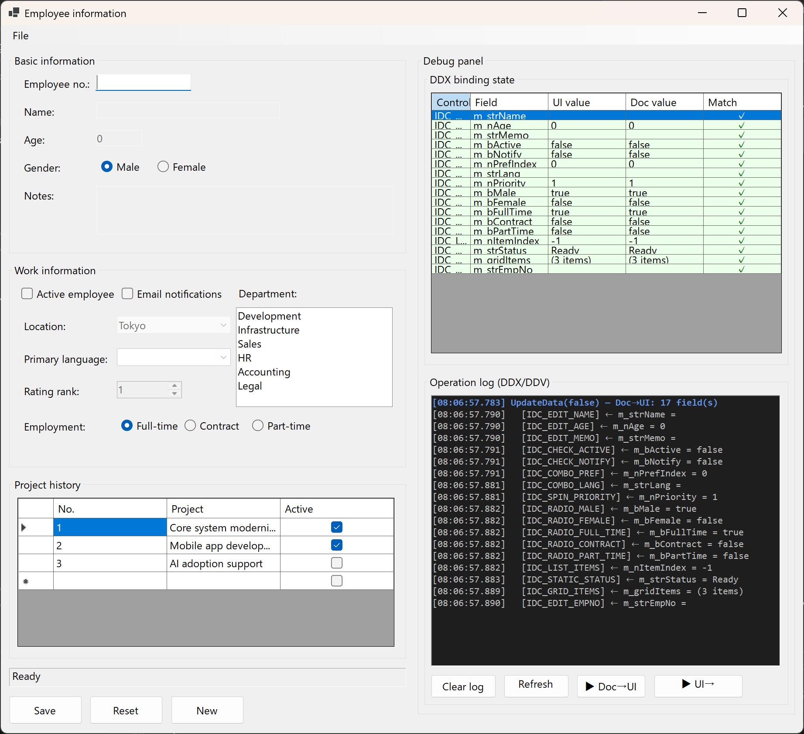

# Windows Forms Document–View

**MFC の Document–View パターン**を **.NET WinForms** に近い形で再現するための小さなフレームワークです。`DoDataExchange` の `DDX_*` / `DDV_*` を、ドキュメント側のフィールドに付ける **C# アトリビュート**に置き換え、ロジックを Document に集約しやすくします。MFC からの移植コストを抑えることを目的としています。

**言語:** [English](README.md) · [日本語](README.ja.md)

## 主な機能

- **`MfcDocument`** — `AttachView`、`UpdateData(true|false)` により、MFC の UI→ドキュメント保存・検証 / ドキュメント→UI 反映に相当する流れを実現
- **宣言的バインディング** — `[DDX(...)]` と `[DDV*]` で、手書きのデータ交換コードを削減
- **Roslyn Source Generator** — `partial` を付けた Document クラスに対してコンパイル時に `BuildEntries()` オーバーライドを生成し、ホットパスのリフレクションを直接フィールドアクセスに置き換え（`partial` を付けないクラスはリフレクション fallback のまま動作）
- **`MfcWinApp`** — `CWinApp` / `InitInstance` とメッセージループに相当する `Run()` の入口
- **`IMessageBoxService`** — `MessageBox` の抽象化（単体テストでモック注入可能）
- **`ResourceId` + `[AutoId]`（任意）** — `resource.h` 風のコントロール ID を揃えたい場合に利用

## 動作環境

- **Windows**（WinForms）
- **.NET 10**（`net10.0-windows`）かつ Windows Forms 有効
- **Visual Studio 2022** など、.NET 10 SDK が使える開発環境

## リポジトリ構成

| パス | 役割 |
|------|------|
| `DocumentView.Framework/` | 再利用可能なフレームワーク本体（`MfcWinApp`、`MfcDocument`、DDX/DDV、変換など） |
| `DocumentView.Framework.Generator/` | Roslyn Incremental Source Generator — `partial` な Document クラスに対してデリゲートベースの `BuildEntries()` を生成 |
| `DocumentView.Sample/` | サンプル 1 — 従業員情報アプリ（Document 1 つ） |
| `DocumentView.Sample2/` | サンプル 2 — 発注管理アプリ（1 つの Form に 3 つの Document をアタッチ） |
| `DocumentView.Framework.Tests/` | フレームワークの単体テスト |
| `DocumentView.Sample.Tests/` | サンプル 1 の単体テスト |
| `DocumentView.Sample2.Tests/` | サンプル 2 の単体テスト |
| `docs/architecture.md` | アーキテクチャ概要（英語） |
| `docs/architecture.ja.md` | アーキテクチャ概要（日本語） |
| `MFC/` | **参考用** — C# サンプルに対応する VC++ 6.0 風 MFC の構成例（そのままビルド保証なし） |

## ビルドと実行

```bash
dotnet build WindowsFormsDocumentView.slnx

# サンプル 1 — 従業員情報
dotnet run --project DocumentView.Sample/DocumentView.Sample.csproj

# サンプル 2 — 発注管理
dotnet run --project DocumentView.Sample2/DocumentView.Sample2.csproj
```

各サンプルは `Microsoft.Extensions.DependencyInjection` でサービスを登録し、`MfcWinApp` を解決して `Run()` します。

## スクリーンショット

**サンプル 1 — 従業員情報**

DDX のバインディング状態（コントロール ↔ ドキュメントのフィールド）や、`UpdateData` / 検証に関する操作ログを表示するデバッグパネルがあり、MFC 風ダイアログのデータ交換を追跡するイメージに近い確認ができます。



**サンプル 2 — 発注管理**

MFC SDI アプリにおける **3 ダイアログ構成**（`IDD_SUPPLIER_INFO`、`IDD_ORDER_HEADER`、`IDD_ORDER_DETAIL`）を 1 つの WinForms ウィンドウへ移植した例です。独立した 3 つの `MfcDocument` サブクラスをすべて同一の `Form` にアタッチします。デバッグパネルは 3 つの Document の DDX 状態を統合して表示します。

## コード例（概念）

`MfcDocument` は `IMessageBoxService` をコンストラクタで受け取ります（サンプルは `Microsoft.Extensions.DependencyInjection` で登録・注入）。ドキュメントのメンバーにアトリビュートを付け、`UpdateData` 呼び出しでコントロールとフィールドの間で値をやり取りします。

`partial` を付けることで、Source Generator がコンパイル時に直接フィールドアクセスのコードを生成します（リフレクション不要）:

```csharp
public partial class SampleDocument : MfcDocument   // partial → Generator が BuildEntries() を生成
{
    public SampleDocument(IMessageBoxService messageBoxService) : base(messageBoxService) { }

    [DDX(SampleView.Ctrl.IDC_EDIT_NAME)]
    [DDVMaxChars(30)]
    public string m_strName = string.Empty;

    [DDX(SampleView.Ctrl.IDC_EDIT_AGE)]
    [DDVMinMax(0, 150)]
    public int m_nAge = 0;
}
```

`partial` を省略しても問題ありません。`MfcDocument.BuildEntries()` のリフレクション実装がそのまま fallback として動作します。

グリッドやボタン処理を含む全体の流れは `DocumentView.Sample/SampleDocument.cs`、`SampleView.cs`、`Program.cs` を参照してください。

**複数 Document パターン**（サンプル 2）については [docs/architecture.ja.md](docs/architecture.ja.md#1-つの-form-に複数の-document-をアタッチする) を参照してください。

## ドキュメント

- [docs/architecture.md](docs/architecture.md) — プロジェクト構成、MFC 対応表、各ファイルの責務（英語）
- [docs/architecture.ja.md](docs/architecture.ja.md) — 上記と同内容（日本語）
- [MFC/README.jp.md](MFC/README.jp.md) — MFC フォルダと C# サンプルの対応関係

## ライセンス

本プロジェクトは [BSD 3-Clause License](LICENSE)（BSD 3条項ライセンス）の下で提供されます。
